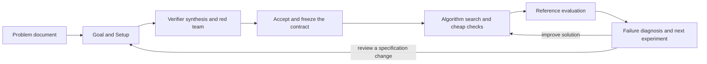

# VeriSpiral

**A research workflow that starts with a problem document and jointly develops
Goal, Setup, Verifier and Algorithm through executable feedback.**

The user describes a problem. Agents clarify the objective, choose a tractable
setup, look for mathematical structures that make verification affordable,
construct candidate algorithms and challenge them. More faithful evaluation
then informs which experiment or revision to attempt next.



Verifier construction and diagnostic experiment selection are central research
activities. Versioning, budgets and evidence records support those activities.
An agent can propose a certificate, a forward check, a dual bound or a different
formulation; the framework must execute the resulting work and retain failures.
The [research agenda](docs/research-agenda.md) states the hypotheses and
comparisons. Research-effectiveness and cross-task learning gains are not established.

## Start with a research case

The primary interface is `verispiral case`. Run `make` to see its stages, or:

```bash
python3 -m pip install -e .
verispiral case --help
```

Use the [host workflow](prompts/protocols/run_case.md) with a paragraph or document.
The host invokes the research agents and available domain tools. The program
records their submissions and executes their generated Python components.
It does not contain a built-in LLM client or turn a prewritten fixture into an
agent response.

A minimal case uses a problem document, a separately selected reference
program, and a new workspace outside Git:

```bash
verispiral case new --problem problem.md --workspace ../research-case \
  --reference reference.py --reference-scope "State the reference's exact scope"
verispiral case next --workspace ../research-case
```

Then submit a design, execute its audit, record the applicable decision, and
run the solver, checker and reference. Actual feedback feeds a diagnosis and
solution or specification revision. The [case guide](docs/case-workflow.md)
defines the commands, program interfaces, role submissions and limits.
The user owns material goal, setup and verifier changes; existing applicable
authorization can be recorded without inventing another confirmation step.

## What the new main workflow executes

- Original problem preservation, assumptions and material unknowns.
- An agent-authored goal/setup/verifier proposal and executable red-team audit.
- A decision bound to the reviewed design and checker identity.
- Submitted solver, checker and separately configured reference programs.
- Actual execution receipts, reference disagreements, bounded calls and errors.
- Diagnosis tied to the latest run, a new solution or reviewed design, and
  fresh evaluation of a retained candidate under a compatible successor.

These are executable control capabilities, covered by
[case workflow tests](tests/test_case_workflow.py) and
[program execution tests](tests/test_case_execution.py). Tests use deliberately
constructed public programs. They do not prove scientific validity, hidden-test
isolation or an LLM's ability to invent useful methods.

The runner supports local development cases and standalone Python programs
that exchange JSON. It records declared role identities; the host is responsible
for actually invoking those roles. It measures program attempts and elapsed
execution time, while model work and component operation costs must be reported
separately. All current case feedback is development material.

## Responsibilities and replaceable components

| Responsibility | Work |
| --- | --- |
| Goal / Setup | Interpret requirements, alternatives, assumptions and omitted mechanisms |
| Verifier Designer | Find a checking mechanism and produce a contract plus executable checker |
| Solver | Produce an executable algorithm and use actual failure feedback |
| Red Team | Challenge the checker and candidate with reproducible counterexamples |
| Research Controller | Compare failure explanations and allocate the next experiment |
| Reference evaluator | Assess the original candidate against the declared target |

A verifier-design agent, its checker program and the reference evaluator are
separate components. Role work is submitted through explicit artifacts; another
host or researcher can provide their own implementation. A plugin installer,
provider discovery and automatic model routing are not implemented.

[Agent experience learning](docs/agent-learning-architecture.md) remains an
extension of this workflow. It can improve how roles research future problems;
it is not a mandatory candidate-to-Skill pipeline and persistent learning is
not implemented.

## Reusable mechanisms and earlier demos

Earlier demos remain available as regression material and optional domain
examples. They do not define the input or required endpoint of a new case.

| Mechanism | Command | Evidence and scope |
| --- | --- | --- |
| Connected finite DAG adapter | `make workflow-demo` | [Guide](docs/connected-workflow.md): prewritten methods, recorded decisions and rechecks |
| Path certificates and witness repair | `make path-trial` | [Study](docs/path-workflow-study.md): includes no established efficiency benefit over direct solving |
| Concurrent finite diagnostic indicators | `make diagnosis-demo` | [Guide](docs/diagnosis-demo.md): small public cases, not general causal diagnosis |
| Specification succession and branches | `make research-loop-demo` | [Contract](docs/research-specification-coevolution.md): bounded decision replay |
| Candidate review, process patches and certificate fields | `make demo`, `make evolution-demo`, `make minimax-demo` | [Earlier mechanisms](docs/reviewer-guide.md): scoped validation, not a general research pipeline |

A new case does not require paper novelty fields, a minimax claim, or a Skill
blueprint. Proof and literature tools are invoked when the problem needs them.

## Inspect and verify

```bash
make verify golden-check
```

- [Project brief](PROJECT_BRIEF.md)
- [Architecture](docs/architecture.md)
- [Problem compilation](prompts/protocols/problem_compilation.md)
- [Problem-driven iteration](prompts/protocols/problem_driven_iteration.md)
- [Claim–evidence matrix](docs/claim-evidence-matrix.md)
- [Verifier learning specialization](docs/verifier-experience-learning.md)
- [Change control](docs/self-evolution-workflow.md)
- [中文说明](README_ZH.md)

The repository contains purpose-built public fixtures. Actual case inputs,
private conversations and raw research outputs stay in authorized workspaces
outside Git. Programs execute with the host's permissions; the runner is not a
security sandbox and its file hashes do not cover arbitrary dependencies.
The project uses the [MIT license](LICENSE).
