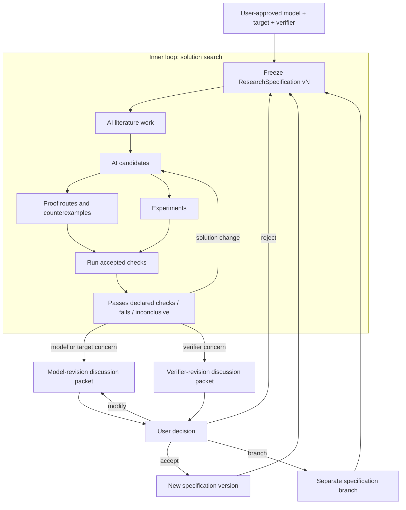
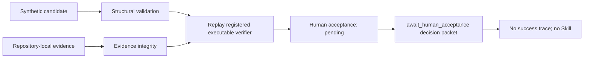
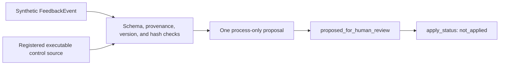
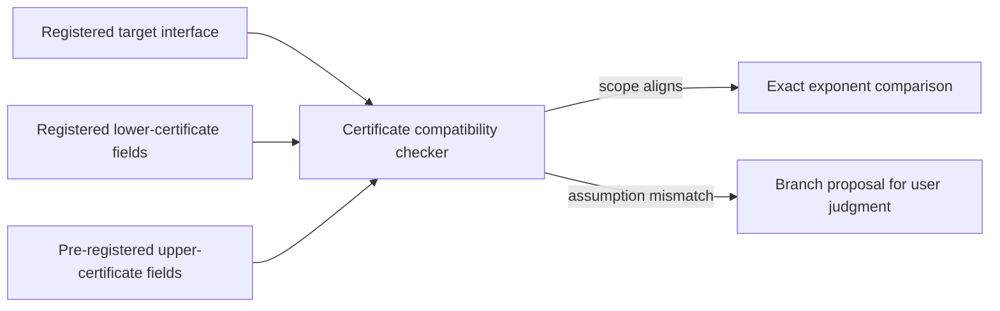

# VeriSpiral

**A user-governed, verifier-guided workflow for research-specification
co-evolution and solution search.**

VeriSpiral separates two loops. In the inner loop, AI may search literature,
generate solution candidates, develop proof routes, seek counterexamples, and
design experiments under a frozen research specification. In the outer loop,
AI may prepare a model- or verifier-revision discussion packet, but only the
user may `accept`, `reject`, `modify`, or `branch` it.

The user owns the accepted scientific model, target, verifier contract, and
scientific judgment boundary. “Co-evolution” means that explicit evidence and a
user decision can produce a new version of that specification. It does not mean
automatic personalization, long-term learning, or silent self-modification.

The current repository is a deterministic reference implementation of four
small artifact paths. It does not run the complete research loops described
above.

## 60-second view

| Question | Answer |
| --- | --- |
| What problem does it address? | Research agents can generate plausible solutions while silently changing the problem, target, or test used to judge them. |
| What does the user control? | The accepted model, target, verifier, and boundary of scientific interpretation. |
| What may AI do? | Literature work, candidate generation, proof routes, counterexamples, experiments, and model/verifier revision proposals. These are target responsibilities, not capabilities implemented by this demo. |
| What is the core separation? | Inner-loop solution search versus outer-loop research-specification revision. A solution delta never shares a patch with model or verifier deltas; a coupled model/verifier revision must expose both. |
| What runs today? | Four deterministic replays: a five-stage candidate review that stops at pending human acceptance, synthetic feedback to an unapplied process patch, bandit certificate compatibility, and user-governed research-specification succession and branching. |

## Two loops, one authority boundary



AI can expose a mismatch and draft a bounded revision. It cannot decide that a
changed problem is “close enough,” weaken a verifier to rescue a preferred
solution, or authorize a revision. The public runner can apply a checked-in
decision fixture to a versioned branch, but that is not live user approval. See [research-specification
co-evolution](docs/research-specification-coevolution.md) for the full contract.

## Keep three change classes separate

| Change | Examples | Rule |
| --- | --- | --- |
| Solution | Candidate algorithm, supporting lemma or proof claim that leaves the accepted theorem target unchanged, proof route, counterexample, experiment | Model, target, and verifier stay frozen |
| Model | Observation model, assumptions, parameter class, loss, target, baseline class, success criterion | Create a separate target lineage; do not count it as solving the original target |
| Verifier | Check logic, accepted evidence, threshold, fixture, certificate interface, interpretation rule | Re-run affected results; do not change the model or target |

If model and verifier revisions are coupled, a composite discussion packet must
keep the two deltas and their consequences separately reviewable. It remains a
specification revision, and the user chooses whether to accept, reject, modify,
or branch it.

## What is executable now

### 1. Five-stage candidate review



The five reported stages are `structural_validation`, `evidence_integrity`,
`semantic_verification`, `human_acceptance`, and `candidate_lifecycle`. The
default fixture replays the registered executable verifier and validates its
receipt against the complete semantic subject. Its stage statuses are
`pass / pass / verified / pending / ready_for_verification`, so the final
decision is `await_human_acceptance`.

The tracked manifest contains only the decision packet. Because no human
acceptance record is present, the run emits neither `success_trace.json` nor an
induced Skill. A passed receipt establishes only the registered verifier's
recorded scope; it is not human acceptance or general scientific validation.

### 2. Synthetic feedback to an unapplied process patch



The checked-in event requests one process instruction. Its source must be bound
to registered, executable control evidence rather than a self-declared success.
The runner emits an unapplied patch and stops. This is not a model-revision
packet, a verifier-revision packet, a recorded human decision, or automatic
evolution.

Tracked inputs and outputs:

- [feedback event](examples/evolution/feedback_event.json)
- [source and component registry](examples/evolution/registry.json)
- [constrained proposal](examples/expected/evolution/evolution_proposal.json)
- [unapplied patch](examples/expected/evolution/evolution_patch.json)
- [artifact manifest](examples/expected/evolution/manifest.json)

### 3. Bandit certificate-compatibility replay



The CLI command is named `minimax`, but the runner is not a theorem verifier.
It compares checked-in problem-signature strings, assumptions, and rational rate
exponents. The three candidates are pre-registered; the code neither generates
an algorithm nor validates the papers' proofs or the certificate extraction.
The recorded assumption branch is demo state, not evidence that a user accepted
a new scientific model.

The fixed replay prints:

```text
UCB-like:       log_gap
MOSS:           not_comparable on the unknown-horizon target
MOSS-anytime:   minimax_rate_match on the original target
```

Here `minimax_rate_match` is a narrow machine status: compatible registered
interfaces have matching stored exponents. It is not a proof or an authorized
minimax claim. See the [certificate-compatibility guide](docs/minimax-verifier.md).

### 4. Research-specification co-evolution replay

This path validates registered specification files, their hashes, an AI-authored
revision discussion, and a checked-in human-decision event. An accepted
verifier-only revision becomes an immutable successor on the same target
lineage, supersedes the earlier verifier version, and is used by later rounds.
A model change creates a separate target lineage and cannot earn progress on
the original target.

The fixture supports model revisions, verifier revisions, and a declared
`model_and_verifier_revision` whose two deltas remain explicit. Coupled changes
follow the separate-model-branch rule. The replay demonstrates decision binding,
verifier succession, model-lineage isolation, and source-payload replay against
the registered scenario. A recorded decision cannot switch the AI discussion's
revision class; that requires a new proposal and discussion. The runner does
not capture live user input, establish that the recorded actor is a real
person, generate an algorithm or proof, or make a scientific claim true.

## Run the demos

Prerequisites: Python 3.10 or newer and `make`. No API key or network access is
required.

```bash
make demo
make evolution-demo
make minimax-demo
make research-loop-demo
make test
make golden-check
make audit
```

Generated files are written under `demo/output/` and ignored by Git. Tracked
reference artifacts live under `examples/expected/`. Golden tests establish
byte-identical replay of the fixtures, not scientific correctness.

## Repository map

- [Research-specification co-evolution](docs/research-specification-coevolution.md):
  user/AI responsibilities, inner and outer loops, change classes, and decision
  semantics.
- [Architecture](docs/architecture.md): system boundary and mapping from the
  conceptual design to the public demos.
- [Change-control workflow](docs/self-evolution-workflow.md): the implemented
  feedback path and its stop boundary.
- [Project brief](PROJECT_BRIEF.md): compact scope and claims.
- [Design principles](docs/design-principles.md): invariants behind the design.
- [Reviewer guide](docs/reviewer-guide.md): a short inspection path.
- [Certificate-compatibility guide](docs/minimax-verifier.md): exact bandit
  replay semantics and sources.
- [Claim-evidence matrix](docs/claim-evidence-matrix.md): executable claims and
  their limits.
- [Related projects](docs/related-projects.md): sourced scope comparison.
- [`src/verispiral/`](src/verispiral/): deterministic orchestration and
  validation code.
- [`schemas/`](schemas/), [`examples/`](examples/), and [`tests/`](tests/):
  contracts, fixtures, and executable checks.

## Current limits

- The repository does not call an LLM or search literature.
- It does not generate real algorithms, theorem statements, proofs,
  counterexamples, or experiments.
- It can validate checked-in discussion and human-decision fixtures, continue a
  target under an accepted verifier successor, and isolate a changed model on a
  separate lineage. It does not capture live decisions or prove the
  decision-maker's identity.
- It does not automatically authorize model or verifier changes, apply the
  process-feedback patch, execute rollback, personalize a system, maintain a
  user model, or learn over time.
- Structural validation and hashes do not establish evidence semantics.
- The certificate replay does not prove a theorem, validate a source
  extraction, establish novelty, or authorize a scientific claim.
- The default candidate demo stops at pending human acceptance and emits no
  success trace or Skill.

See [data and privacy](DATA_AND_PRIVACY.md),
[model and human contributions](MODEL_AND_HUMAN_CONTRIBUTIONS.md), and the
[public-release checklist](PUBLIC_RELEASE_CHECKLIST.md).

中文说明：[README_ZH.md](README_ZH.md)
