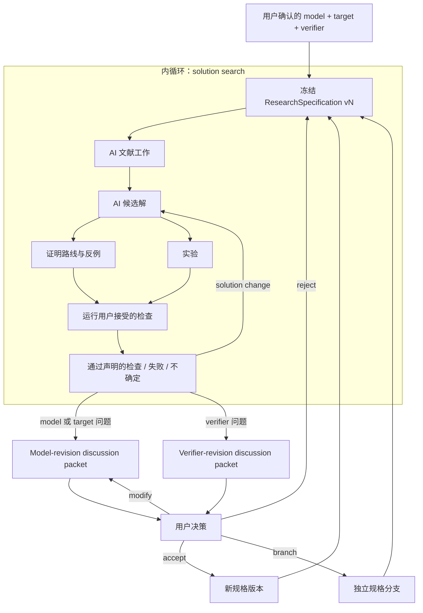
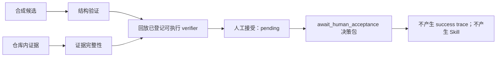
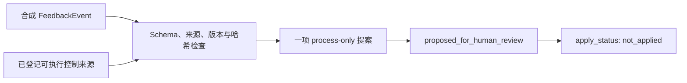
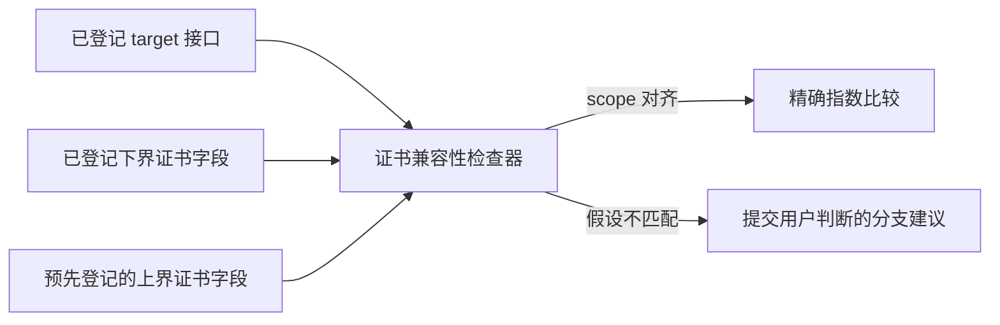

# VeriSpiral

**一个由用户治理、验证器引导，用于科研规格协同演化与解空间搜索的工作流。**

VeriSpiral 把科研过程分成两个循环。内循环在冻结的科研规格下进行：AI 可以检索
文献、生成候选解、设计证明路线、寻找反例和设计实验。外循环处理科研规格本身：
AI 可以准备 model revision 或 verifier revision 的讨论包，但只有用户可以对它
执行 `accept`、`reject`、`modify` 或 `branch`。

用户掌握最终采用的科学模型、target、verifier 契约和科学判断边界。“协同演化”
表示证据与用户决策可以形成一个显式版本化的新规格；它不表示自动个性化、长期
学习或系统静默修改自己。

当前仓库只是四个小型、确定性产物路径的参考实现，并没有执行上述完整科研循环。

## 60 秒了解项目

| 问题 | 回答 |
| --- | --- |
| 它解决什么问题？ | 科研智能体可以持续产生看似合理的解，同时不知不觉改变问题、target 或评价这些解的检查方法。 |
| 用户掌握什么？ | 最终采用的模型、target、verifier，以及科学解释的边界。 |
| AI 可以负责什么？ | 文献、候选解、证明路线、反例、实验，以及 model/verifier revision 提案。这是目标分工，不是当前 demo 已实现的能力。 |
| 最重要的分离是什么？ | 内循环 solution search 与外循环 research-specification revision 分开。solution delta 不能和 model/verifier delta 共用 patch；联动修订也必须分别展示两部分。 |
| 当前能运行什么？ | 四条确定性回放：停在人工接受待定状态的五阶段候选审查、合成反馈到未应用流程补丁、bandit 证书兼容性比较，以及用户治理的科研规格继任与分支。 |

## 两个循环，一条权限边界



AI 可以暴露不匹配并起草边界明确的修改建议，但不能决定“修改后的问题与原问题足够
接近”、为了挽救某个解而削弱 verifier，也不能批准修改。公开 runner 可以把仓库内
预登记的决策 fixture 应用为版本化分支，但这不等于现场用户批准。完整契约见
[科研规格协同演化](docs/research-specification-coevolution.md)。

## 严格分开三类变化

| 变化 | 例子 | 规则 |
| --- | --- | --- |
| Solution | 候选算法、不改变既定定理 target 的辅助引理或证明主张、证明路线、反例、实验 | model、target 和 verifier 保持冻结 |
| Model | 观测模型、假设、参数类、损失、target、基线类、成功条件 | 建立独立 target lineage；不能算作解决了原问题 |
| Verifier | 检查逻辑、可接受证据、阈值、fixture、证书接口、解释规则 | 重新检查受影响结果；不能同时修改 model 或 target |

如果 model 与 verifier 必须联动调整，复合讨论包也必须把两部分 delta 及影响分开
展示。它仍然是规格修订，只有用户能决定 `accept`、`reject`、`modify` 或 `branch`。

## 当前可执行的部分

### 1. 五阶段候选审查



五个状态分别是 `structural_validation`、`evidence_integrity`、
`semantic_verification`、`human_acceptance` 和 `candidate_lifecycle`。默认 fixture
会真实回放已登记的可执行 verifier，并把 receipt 与完整 semantic subject 绑定。
五项状态为 `pass / pass / verified / pending / ready_for_verification`，所以最终决策
是 `await_human_acceptance`。

tracked manifest 只包含 decision packet。由于没有人工 acceptance record，本次运行
不会生成 `success_trace.json`，也不会生成 induced Skill。receipt 通过只说明已登记
verifier 在声明范围内通过，不能代替人工接受或一般性的科学验证。

### 2. 合成反馈到未应用的流程补丁



仓库内事件只请求增加一条流程说明。来源必须绑定到已登记、可执行的控制证据，不能
依赖自我声明的成功。运行器生成未应用补丁后停止。这不是 model revision packet、
verifier revision packet、已记录的人工决策或自动演化。

相关输入与输出：

- [反馈事件](examples/evolution/feedback_event.json)
- [来源与组件 registry](examples/evolution/registry.json)
- [受约束提案](examples/expected/evolution/evolution_proposal.json)
- [未应用补丁](examples/expected/evolution/evolution_patch.json)
- [产物清单](examples/expected/evolution/manifest.json)

### 3. Bandit 证书兼容性回放



CLI 命令名是 `minimax`，但运行器不是定理验证器。它比较仓库内登记的问题签名
字符串、假设和有理数速率指数。三个候选在运行前就已登记；代码不会生成算法，也
不会验证论文证明或证书摘录的正确性。产物中的假设分支只是 demo 状态，不表示用户
接受了新的科学模型。

固定回放输出：

```text
UCB-like：       log_gap
MOSS：           在 unknown-horizon target 上 not_comparable
MOSS-anytime：   回到原始 target 并得到 minimax_rate_match
```

这里的 `minimax_rate_match` 是很窄的机器状态：兼容的登记接口具有相同的已存指数。
它不是证明，也不是获准公开的 minimax 结论。详见
[证书兼容性说明](docs/minimax-verifier.md)。

### 4. 科研规格协同演化回放

这条路径验证已登记的规格文件及哈希、AI 起草的修订讨论，以及仓库内预登记的人工
决策事件。被接受的 verifier-only 修订会成为同一 target lineage 上的不可变继任
版本，替代旧 verifier 并供后续 round 使用；model change 则建立独立 target lineage，
不能把结果计入原 target。

fixture 支持 model revision、verifier revision，以及把两部分 delta 明确分开的
`model_and_verifier_revision`；联动修订遵循独立 model branch 规则。它演示的是决策
绑定、verifier 继任、model lineage 隔离，以及依据登记 scenario 重算事件来源。
人工决策不能偷换 AI discussion 的 revision 类型；如果想从 model revision 改成
verifier revision，必须重新形成提案与讨论。它不会采集现场用户输入，不能证明
记录中的 actor 是真实的人，也不会生成算法、证明或确立科学结论。

## 运行演示

需要 Python 3.10 或更新版本，以及 `make`。不需要 API Key 或网络连接。

```bash
make demo
make evolution-demo
make minimax-demo
make research-loop-demo
make test
make golden-check
make audit
```

生成文件写入 `demo/output/`，不会进入 Git；参考产物位于 `examples/expected/`。
Golden test 只能说明合成 fixture 可逐字节复现，不能说明科学正确性。

## 仓库地图

- [科研规格协同演化](docs/research-specification-coevolution.md)：用户与 AI 分工、
  内外循环、变化类型和决策语义；
- [架构](docs/architecture.md)：系统边界以及概念设计与公开 demo 的对应关系；
- [变化控制工作流](docs/self-evolution-workflow.md)：已实现反馈路径及停止边界；
- [项目简述](PROJECT_BRIEF.md)：精简范围与声明；
- [设计原则](docs/design-principles.md)：系统约束；
- [审阅指南](docs/reviewer-guide.md)：快速检查路径；
- [证书兼容性说明](docs/minimax-verifier.md)：bandit 回放语义与来源；
- [声明—证据矩阵](docs/claim-evidence-matrix.md)：可执行声明及边界；
- [同类项目](docs/related-projects.md)：有来源的范围比较；
- [`src/verispiral/`](src/verispiral/)：确定性编排与验证代码；
- [`schemas/`](schemas/)、[`examples/`](examples/) 和 [`tests/`](tests/)：契约、
  fixture 与可执行检查。

## 当前边界

- 仓库不调用 LLM，也不检索文献。
- 仓库不生成真实算法、定理陈述、证明、反例或实验。
- 仓库可以验证已登记的讨论与人工决策 fixture，在同一 target lineage 上继续使用
  已接受 verifier successor，并把改变后的 model 隔离到独立 lineage；它不采集现场
  决策，也不能证明决策者身份。
- 仓库不会自动批准 model/verifier 变化，不会应用流程反馈补丁或执行回滚，也不会
  个性化系统、维护用户模型或长期学习。
- 结构验证和哈希不能证明证据内容正确。
- 证书回放不能证明定理、验证来源摘录、确认新颖性或批准科学结论。
- 默认候选 demo 停在人工接受待定状态，不生成 success trace 或 Skill。

公开边界见 [DATA_AND_PRIVACY.md](DATA_AND_PRIVACY.md)，人与 AI 的贡献边界见
[MODEL_AND_HUMAN_CONTRIBUTIONS.md](MODEL_AND_HUMAN_CONTRIBUTIONS.md)，发布前检查见
[PUBLIC_RELEASE_CHECKLIST.md](PUBLIC_RELEASE_CHECKLIST.md)。

English documentation: [README.md](README.md)
