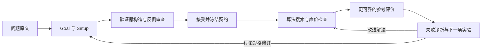

# VeriSpiral

**从一段问题或长文档出发，通过真实实验反馈共同设计 Goal、Setup、Verifier 和 Algorithm 的科研工作流。**

用户给出问题，agent 澄清目标、设计模型、寻找巧妙且可负担的验证机制，再构造算法。
更可靠的评价揭示问题后，系统通过区分性实验决定下一步应改算法、检查器、建模还是目标。



研究重点是验证器的数学构造与下一项诊断实验的选择。预算、版本和证据记录支撑这些
研究活动。系统应实际执行 agent 产出的算法与检查器，保留失败和无法判断的结果。
[研究议程](docs/research-agenda.md)列出待检验的假设；当前没有证明通用科研优势或跨任务学习收益。

## 从实际问题开始

主入口是 `verispiral case`。运行 `make` 查看阶段，或：

```bash
python3 -m pip install -e .
verispiral case --help
```

由当前承载任务的 AI 助手按[实际问题运行协议](prompts/protocols/run_case.md)调用各角色。
程序接收它们提交的设计和代码，执行检查、保存反馈并推进状态；程序本身没有内置模型客户端。
一段预写好的成功输出不能代替真实 agent 调用。

准备问题文档、单独选择的参考程序，以及 Git 之外的新工作目录：

```bash
verispiral case new --problem problem.md --workspace ../research-case \
  --reference reference.py --reference-scope "明确写出参考能判断什么及其范围"
verispiral case next --workspace ../research-case
```

接下来提交设计、实际运行审查、记录适用的决定、执行求解器与两层检查，再根据反馈
提交诊断和修订。[运行说明](docs/case-workflow.md)给出完整命令与文件接口。
目标、建模及验证契约的重要变化由用户决定；已有适用授权可以直接记录。

## 主流程当前能做什么

- 保留问题原文，区分假设与影响结论的未知。
- 接收 agent 设计的目标、设置和检查器，执行另行编写的反例审查。
- 将接受决定绑定到已审查的设计和检查器版本。
- 实际运行提交的算法、廉价检查器和单独配置的参考程序。
- 保存执行证据、相互矛盾的结果、调用预算、超时与错误。
- 让诊断消费当前运行的反馈，进入解法改进或规格修订，并对保留候选重新检查。

对应证据是[主流程测试](tests/test_case_workflow.py)与
[程序执行测试](tests/test_case_execution.py)。这些测试检查控制机制，不能证明数学正确性、
隐藏评价隔离或模型能发明有用方法。当前支持在本地运行、通过 JSON 交换数据的独立 Python 程序。
角色身份由主持者声明，模型调用由主持者实施；记录身份不等于认证身份。

程序约束调用尝试数和超时，记录实际执行耗时。模型工作及部件声明的计算成本需要另外报告。
当前案例反馈全部属于开发材料，不能作为未见的最终测试。

## 分工与可替换部件

| 职责 | 主要工作 |
| --- | --- |
| Goal / Setup | 原始需求、目标选项、假设、建模取舍和遗漏机制 |
| Verifier Designer | 发现检查机制，提交检查契约及其可执行实现 |
| Solver | 产生可执行算法，利用实际失败反馈修复 |
| Red Team | 用可复现的反例挑战检查器与候选 |
| Research Controller | 保留竞争解释，选择下一项实验和资源投入 |
| Reference evaluator | 针对声明目标评价原始候选 |

设计验证器的 agent、它产生的检查程序、参考评价器是三个不同部件。使用者可以提交自己
的角色产物和可执行实现；当前尚无插件安装、自动发现或模型路由服务。

[各角色的经验学习](docs/agent-learning-architecture.md)继续作为研究流程的扩展。
它帮助以后研究得更好，不要求每道题都产出 Skill；持续学习尚未实现。

## 可复用机制与早期演示

早期演示保留作回归检查或领域示例，不再决定新问题必须采用的输入格式与终点。

| 机制 | 命令 | 范围与证据 |
| --- | --- | --- |
| 小型图适配器 | `make workflow-demo` | [说明](docs/connected-workflow.md)：预写方法、决策、修复与重检 |
| 路径证书与补证书 | `make path-trial` | [试验](docs/path-workflow-study.md)：保留未建立直接求解效率收益的负结果 |
| 并发故障指示 | `make diagnosis-demo` | [说明](docs/diagnosis-demo.md)：有限公开例子，不等于通用因果诊断 |
| 规格继任与分支 | `make research-loop-demo` | [契约](docs/research-specification-coevolution.md)：有限决策回放 |
| 候选审核、过程补丁、证书字段比较 | `make demo`、`make evolution-demo`、`make minimax-demo` | [早期机制](docs/reviewer-guide.md)：各自具有范围有限的检查意义 |

新主流程不强制填写论文新颖性、minimax 结论或 Skill 蓝图。文献和证明工具按问题需要接入。

## 检查与文档

```bash
make verify golden-check
```

- [项目简述](PROJECT_BRIEF.md)
- [架构](docs/architecture.md)
- [问题编译](prompts/protocols/problem_compilation.md)
- [问题驱动迭代](prompts/protocols/problem_driven_iteration.md)
- [主张与证据](docs/claim-evidence-matrix.md)
- [验证器经验学习](docs/verifier-experience-learning.md)
- [变化控制](docs/self-evolution-workflow.md)

仓库只保存专门构造的公开材料。实际问题、私人聊天和原始研究输出留在获授权的 Git 外
工作目录。程序使用主持者已有权限运行；执行器不是安全沙箱，文件身份也不覆盖任意依赖。
许可证为 [MIT](LICENSE)。
