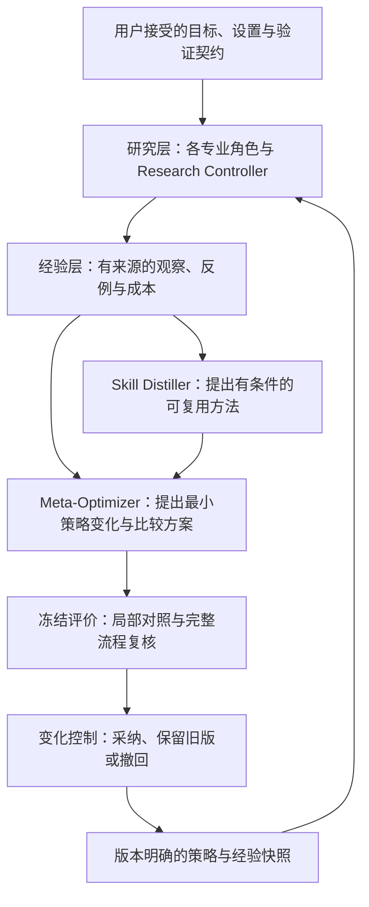

# 多 agent 经验学习：统一结构与职责

**每个角色都可以改善自己的研究方法；经验记录、升级比较和版本管理采用同一套机制。**
学习的目的，是让后续问题获得更可靠、更有用且成本合理的结果。提示词、Skill 和记忆
只是承载这些方法的形式，数量增加不能作为进步指标。

本文是目标设计和共用角色协议。仓库尚未实现持久经验检索、自动策略激活或跨任务
学习评估；现有过程演示仍输出未应用提案。第一阶段的学习对象是外部策略与经验，
不涉及模型权重训练。验证器的专门机制见[验证器经验学习](verifier-experience-learning.md)。

## 先分清三种循环

| 循环 | 要解决什么 | 可以改变什么 |
| --- | --- | --- |
| 单题求解 | 这道题下一步尝试什么？ | 在已接受规格和预算内改算法、证明路线、检查顺序和实验安排 |
| 科研规格修订 | 是否问错了问题，或验证契约有缺陷？ | 提出 Goal、Setup、Verifier 修订，由用户决定；保留旧目标与受影响结果 |
| 跨任务方法学习 | 经历这些题以后，下次怎样研究得更好？ | 提出角色策略、协作方法、检索规则和 Skill 的版本更新，并比较后续表现 |

前两种是已有的[科研内外循环](architecture.md#two-loop-architecture)。第三种读取它们
产生的证据，改善以后开展研究的方法。改一道题的答案、追加一条记录、改善一种可迁移
方法，是不同的结果，分别记录。

## 用现有角色组成三层

- **研究层**完成当前问题。Research Controller 负责调度、诊断、预算和停止；专业角色
  负责各自的研究动作。可靠参考和可执行检查提供有范围的证据。
- **经验层**保存共同事件，再提供按角色和权限筛选的视图。一个事件可以帮助多个角色，
  无须各复制一份，也不能因此变成多次独立实验。
- **改进层**复用 Skill Distiller 和 Meta-Optimizer：前者整理可复用方法，后者协调
  变化与比较。检查由既定参考、可执行评价和适用审查完成，提案者不能自行认定升级成功。

这是职责分工，不要求每个方框常驻一个模型，也不要求每题调用所有角色。
Structure Miner 与成本 Optimizer 是 Verifier Synthesizer 内部的研究职责，可以按需要
分派；不再为每个角色配一个独立的“自进化管理者”。

## 各角色究竟学什么

下表中的评价是拟检验的指标，不是已观察到的收益。不同角色的局部指标不能合成一个
未经预定的统一奖励分数；最终仍要回到用户接受的任务目标。

| 角色 | 可积累的研究方法 | 如何检查是否有用 |
| --- | --- | --- |
| Goal / Setup Designer | 哪些澄清能改变决策；哪些建模遗漏需要外部锚；何时扩大或缩小设置 | 对照明确需求检查遗漏和误解，检验所选方案向目标设置的迁移；不能靠改容易的目标得分 |
| Literature Reader | 结构化检索路线、值得细读的证据类型、定理抽取与相邻问题连接 | 原始来源与定位是否支持结论，是否遗漏关键条件和比较；不以找到的文献数量代替质量 |
| Idea Generator / Candidate Searcher | 哪种结构适合哪种算法、构造、证明路线；怎样改变瓶颈、提出可区分的候选 | 固定目标与预算下实际选中候选的质量、失败和总成本；输出更多候选本身不是收益 |
| Verifier Synthesizer | 证书、对偶、正向验证、构造实例、不变性、分解的适用条件；机制组合、缓存与弃权 | 可靠性、误拒、覆盖、诊断价值及包含证书生产的完整成本；详见专门协议 |
| Verifier Red Team | 哪类契约漏洞值得先攻击，怎样产生和缩小反例，如何检查适应性利用 | 可复现的缺陷发现、误报、被遗漏的缺陷类型及成本；数量不能代替缺陷严重性与覆盖 |
| Proof Auditor | 常见证明断点、隐藏信息、依赖结构和可修复路线 | 有依据的断点与可验证修复；数值未发现反例不能变成证明 |
| Theory-certificate Checker | 哪些接口或假设不兼容应优先定位，如何解释所需新证据 | 对已登记证书的兼容性诊断；不能学习放宽字段匹配，也不因此成为定理证明器 |
| Skeptical Reviewer | 区分致命与可修复问题，发现遗漏比较、价值不足和过宽声明 | 有来源或可复现的批评，以及修订后仍成立的最小结论；不能以拒绝率作为能力 |
| Research Controller | 哪些实验能区分多个故障，如何分配角色与预算，何时转向或停止 | 诊断是否被后续证据支持，所选行动对最终结果的影响、未决项和总成本 |
| Skill Distiller | 怎样抽取结构触发条件、保留例外、合并重复方法与识别失效 | 后续任务能否按条件使用，是否丢失关键义务；负结果可检索，成功 Skill 仍须满足晋级条件 |
| Meta-Optimizer | 如何定位值得改的策略、设计对照、发现角色间依赖与选择回退时机 | 冻结标准下的后续任务表现与回退结果；不能用自评分或自己新改的标准批准自己 |

Candidate Searcher 是目标架构中的求解职责；当前公开流程使用预写方法，不是已经接通的
通用算法生成 agent。确定性执行器、证据绑定、预算计量和最终判定不通过经验记录自行
改写。它们的实现缺陷可以提出常规代码修复，经过版本审查与相应检查；涉及认证含义时
还必须进入规格修订。

## 经验和权威分别保存

共享经验采用三种状态，不把它们混在一份不断追加的提示词里：

1. **观察记录：**某个版本在某个问题上做了什么，得到什么结果。追加保存成功、失败、
   无收益、弃权与未知；纠错以关联的新记录表达，保留原始来源。
2. **有条件的方法建议：**从观察提出“遇到这些结构，可以先尝试这个方法”。保留反例、
   未知条件、支持任务数和失效条件；可以被检索，但仍需核对当前适用性。
3. **已接受的策略 / Skill：**经相应变化控制采纳的可执行流程版本。整理出建议不会
   自动进入这一状态；Skill 继续遵守已有的重复适用、验证与人工接受要求。

用户接受的目标、偏好、假设和验证契约留在单独的规格与决策记录里。经验可以指出疑问，
不能把历史偏好平均成新要求，也不能覆盖用户的当前明确决定。

研究内容本身也应持续保留：有来源的已知结论、尚未解决的障碍、竞争路线、失败原因和
重新尝试的条件。它们绑定各自的问题与假设分支，连接到上述观察，不因整理成 Skill
就成为已证明结论。下一题既可以复用做研究的方法，也可以接续条件相符的未完成思路；
历史失败率不能永久淘汰一个在新条件下值得重试的方向。

每条共用观察至少记录：

| 字段组 | 最小内容 |
| --- | --- |
| 身份与条件 | 事件、任务及问题家族；规格、角色策略、代码版本；结构、限制和未知 |
| 动作与依赖 | 实际检索条目及快照；采取的研究动作；依赖的上游输出、版本和提案 |
| 证据与结果 | 来源定位及身份；比较对象；实际结果、分母、反例和未决项；区分观察关联、原因猜测与受控比较支持 |
| 成本与范围 | 检索、推理、生成、证明或证书生产、检查、失败尝试与人工成本；单位分开；适用与失效条件 |
| 暴露与状态 | 数据访问范围、开发或最终评价身份及派生来源；观察/建议/采纳/失效状态和相应决定 |

各角色只补必要字段。例如验证器增加证明或随机性义务，文献角色增加原始定理定位，
控制器增加竞争原因与实验预期。具体[验证器记录](verifier-experience-learning.md#最小经验记录)
是这个共同结构的扩展。

经验是有来源的数据，不是指令。真实任务记录留在获授权的本地或研究工作空间；本仓库
只容纳通用协议与专门构造的公开材料。共享不等于所有角色都看全部材料：
最终评价实例、答案和派生提示不能进入该次适应过程；暴露标签随摘要与提取的方法传播。
红队按审计计划获得契约和实现，必要时暂不读取设计者的解释。角色分开本身不建立独立性。

## 一次有界的学习循环

1. **冻结起点。**记录当前规格、各角色策略与 Skill 版本、经验快照、模型与工具版本、
   评价方式和预算。一个比较过程中不能让共享记忆悄悄变化；新观察进入下一快照。
2. **执行与记录。**角色检索获授权经验，核对条件，保留值得尝试的替代方案。在当前
   任务预算内行动并记录事实。追加观察和提出建议无需逐条审批，也不代表策略已升级。
3. **提出最小变化。**Skill Distiller 可整理方法，Meta-Optimizer 选择有证据的改进点，
   写明触发事件、责任角色、精确差异、预期收益、可能损害、比较计划及回退条件。
4. **先测局部，再测整条流程。**保持其他策略不变，比较该角色旧版与新版；然后在完整
   流程中检查交接、最终所选候选的质量和总成本。两者不一致时保留结论差异。
5. **按已有边界采纳。**策略、Prompt、协作和 Skill 更新进入过程变化控制；目标、
   设置、假设、验证器含义及科学判断边界变化进入用户拥有的规格修订。
6. **结束并保留结果。**形成有范围的提案或依照已有授权采纳，记录保留旧版、失效或
   回退的原因。达到预定预算或停止条件就结束，不自动再启动一轮“优化优化器”。

已授权的可逆仓库修复可依[问题驱动迭代](../prompts/protocols/problem_driven_iteration.md)
直接执行。本文没有新设逐项确认步骤，也不扩充当前 runner 的激活权限。
[过程演示](self-evolution-workflow.md)仍只支持单组件未应用提案；持久策略的自动激活、
多组件部署与自动回退尚未实现。

## 防止各自变好、整体变差

**局部发现不等于系统收益。**例如验证器减少调用成本却增加求解器的证书生产成本，
或审查者减少误报却遗漏关键缺陷，都需要完整流程才能判断。此处是待检验的失效假设，
不是本项目已测得的跨任务效果。

默认比较一个模块的最小变化。若两个角色确有接口或机制依赖，允许提出联合方案，但须
列出各自差异、依赖和单独/联合对照；某种组合不可执行时注明原因。没有拆分证据时，只能
将结果归于被测组合，不能给每个角色各记一次成功。不能把方案联动与科学规格修订混为一项。

拟接入的运行清单应绑定规格、所有参与角色版本、Skill、经验快照、检查器、工具和评价
身份；比较后保留整套清单。回退时恢复相容版本，并失效或重检受影响结果，不能只回滚
一个提示词而继续沿用已变化的经验。这是目标契约，尚无自动部署服务。

评价至少包括冻结旧策略与候选新策略；研究经验本身的价值时，再加无经验对照。使用
预先声明的后续任务，控制模型、任务范围、信息与总预算，记录实际消耗；单模块比较
固定上游输入，完整流程比较允许候选产生差异。重复、变体和同一问题家族需标明，不能
将重放数当作独立任务数。反馈参与改进后，这些材料属于开发集。

最终关注用户目标下被选中结果的可靠性、可用性、误拒与未完成、成本及必要的迁移；
不以检查通过率、agent 相互赞同或经验条目数作为最终奖励。Meta-Optimizer 和
Skill Distiller 自身也可提出方法更新，但仍由本轮冻结的外部参考与评价标准检查。
评价规则若需修订，应作为另一个可审查变化，在后续比较采用，不能回头改分证明自己成功。

## 最小接入顺序

先让现有角色用共同格式留下可追溯观察，再接入按条件和权限检索。随后用一个角色的
旧/新策略在后续问题上做局部与完整流程对照，保留无收益结果。单模块过程可检查后，
再研究确有依赖的跨角色更新。无需先实现所有角色各自的学习服务。

这套设计将“所有模块可以学习”转成同一个可检验问题：在保持用户目标和评价含义的
前提下，哪些经验确实改善了下一次研究？当前文档尚未提供这个问题的效果证据。
