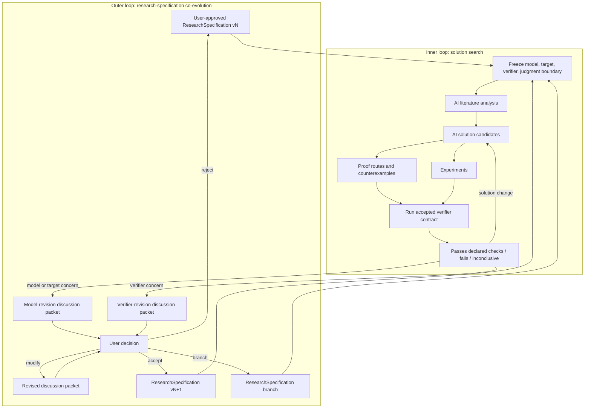
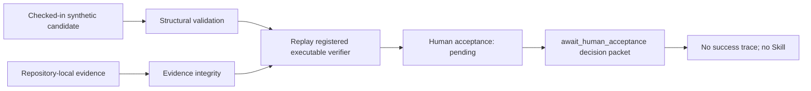
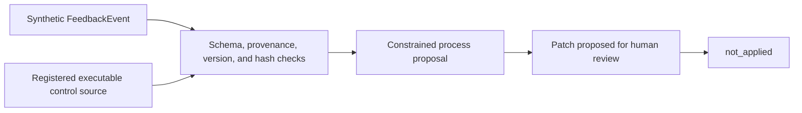
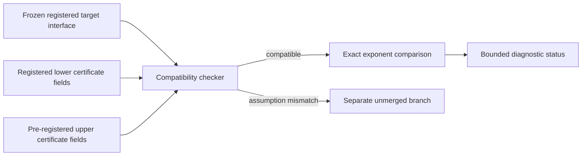
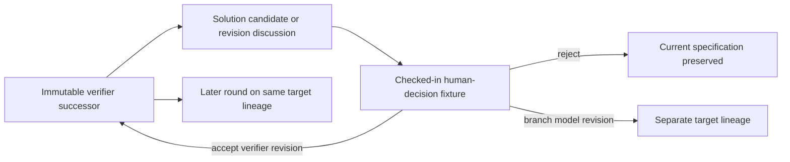

# Architecture

VeriSpiral is a user-governed workflow for research-specification co-evolution
and solution search. It separates AI assistance from scientific authority and
separates changes to a candidate solution from changes to the problem or its
evaluation contract.

The public repository implements four small deterministic demonstrations. The
larger architecture in this document is a design contract, not a claim that an
online autonomous research system already exists.

## System boundary

The repository contains:

1. role and protocol policy expressed in Markdown;
2. typed artifact contracts expressed as JSON Schema;
3. deterministic validation, transformation, replay, and audit code; and
4. synthetic fixtures and tracked reference outputs.

It contains no LLM integration, live literature search, real experiment
runtime, algorithm generator, proof engine, persistent user model, automatic
approval, or patch-application service.

## Authority boundary

The user controls the accepted research specification:

```text
scientific model
+ target
+ verifier contract
+ scientific judgment boundary
```

The scientific model includes the observation process, parameter class,
assumptions, information structure, and admissible interventions. The target
includes the estimand or theorem, loss or objective, comparison class, success
criterion, and kill conditions. The verifier contract states what will be
checked and what a result is allowed to support.

AI may search literature, generate solution candidates, develop proof routes,
seek counterexamples, design or run experiments, and analyze failures. These
are intended responsibilities, not capabilities exercised by the public
runner. AI may also draft a model- or verifier-revision discussion packet. It
may not authorize that packet. The public co-evolution runner applies only a
pre-registered human-decision fixture whose references and hashes validate.

Only the user may:

- accept the working model and target;
- approve or revise the verifier contract;
- decide whether evidence is sufficient for scientific interpretation;
- accept, reject, modify, or branch a model/verifier revision proposal; and
- authorize a manuscript-facing claim.

## Two-loop architecture



The inner loop freezes the entire specification. The outer loop changes the
specification only through an explicit user decision. “Co-evolution” refers to
this evidence-and-decision process; it does not mean automatic learning from a
user over time.

Full transition semantics are in [research-specification
co-evolution](research-specification-coevolution.md).

## Three non-interchangeable changes

| Change | Examples | What it cannot do |
| --- | --- | --- |
| Solution change | New algorithm, theorem candidate under the same target, proof route, counterexample, experiment, or explanation | Alter the model, target, verifier, or interpretation boundary |
| Model change | Observation model, parameter class, assumptions, information structure, loss, target, baseline class, or success criterion | Pretend to be progress on the unchanged parent problem |
| Verifier change | Check logic, accepted evidence types, thresholds, certificate interface, fixtures, or result interpretation | Change the model or target, or preserve prior passes without re-evaluation |

A target change is a model/specification revision with an explicit target
delta. A coupled model-and-verifier revision may use one composite packet only
when the two deltas and their effects remain separately reviewable. It cannot
contain a solution delta. The user decides whether the proposal is accepted,
rejected, modified, or branched.

## Core conceptual artifacts

| Artifact | Carries | Authority boundary |
| --- | --- | --- |
| `ResearchSpecification` | Versioned model, target, verifier contract, and judgment boundary | Accepted only by the user |
| `SolutionCandidate` | Algorithm, theorem candidate, proof route, counterexample plan, experiment, or exposition | Cannot mutate the specification |
| `CheckResult` | Verifier version, inputs, output, scope, and known blind spots | Means only what the accepted contract declares |
| `ModelRevisionDiscussionPacket` | One model/target delta, trigger, affected results, costs, risks, and user questions | AI-authored proposal; AI cannot authorize it |
| `VerifierRevisionDiscussionPacket` | One verifier delta, motivating false pass/fail or gap, affected results, and regression plan | AI-authored proposal; AI cannot authorize it |
| Coupled revision packet | Explicit model and verifier deltas plus separate impact analyses | Still a specification revision; never a solution patch |
| `UserDecision` | `accept`, `reject`, `modify`, or `branch`, with rationale | Required before a new specification version exists |

The public repository implements a deterministic subset of these artifacts. It
does not implement the AI activities that would produce them during live
research.

## Executable artifact contracts

| Artifact | What the public runner checks | What it does not establish |
| --- | --- | --- |
| `CandidateIdea` | Required fields for claim, assumptions, risks, evidence locators, checks, and Skill blueprint | Truth, novelty, or a good scientific target |
| Evidence reference | Repository-local path, identity, and hash linkage | Semantic correctness or independence of the evidence |
| `VerificationReceipt` | Semantic-subject hash, registered executable verifier identity, evidence bindings, replay result, scope, and limitations | Human acceptance or general scientific truth |
| `DecisionPacket` | Five stage statuses, receipt binding, limitations, questions, and `await_human_acceptance` | A success trace, Skill, user acceptance, or scientific authority |
| `FeedbackEvent` | One synthetic process-feedback signal with a registered executable control source and target component | A real user history or research-specification revision |
| `EvolutionPatch` | One process-only unapplied patch proposed for human review | Acceptance, application, or online evolution |
| Theory certificate | Registered source locator, declared problem interface, assumptions, and rate exponents | Source-proof correctness or validity of the extraction |
| Assumption branch | Explicit changed assumptions, parent reference, and non-merge status | User acceptance of the changed scientific model |
| `ResearchSpecification` | Registered model, target, verifier, judgment boundary, version, and hash | That the specification is scientifically correct |
| Revision discussion | AI proposal bound to a base and proposed specification | Authorization to change the specification |
| Human-decision fixture | `accept`, `reject`, `modify`, or `branch` bound to the discussion and proposed hash | Live user input or proof of human identity |
| Co-evolution trace | Event links, same-target verifier succession, separate model lineages, and target-credit isolation | Algorithm generation, proof generation, or scientific truth |

## Public demo 1: five-stage candidate review



The five stage fields are structural validation, evidence integrity, semantic
verification, human acceptance, and candidate lifecycle. The default fixture
actually replays the repository-registered verifier and checks that its receipt
binds the complete semantic subject, declared evidence, verifier artifact, and
replay output. Human acceptance remains `pending`; therefore the tracked run
contains only a decision packet and manifest. It emits no success trace and no
Skill.

## Public demo 2: feedback-to-process-patch



This demo concerns a process instruction only. Its input source must remain
bound to executable control evidence rather than a self-declared success. It
does not propose a scientific model change, target change, or verifier change.
It does not record a human decision or edit the target component.

## Public demo 3: bandit certificate compatibility



The CLI command is named `minimax`, but its implementation is a certificate-
compatibility checker. It compares registered strings and rational exponents.
It does not check a proof, validate a source extraction, infer class
containment, generate a new algorithm, or approve a minimax statement.

## Public demo 4: research-specification co-evolution



The runner validates specification hashes, event references, revision class,
and the exact specification selected by the registered decision. An accepted
verifier-only revision supersedes the earlier verifier version but remains on
the same target lineage, so later work continues that target under the accepted
successor. A model revision—and any coupled model-and-verifier revision—creates
a separate lineage and cannot count as solving the original target.

This is deterministic state-machine replay. It does not capture live user input,
verify the actor's real-world identity, generate a solution or proof, or decide
that the specification is scientifically sound.

## Trust boundaries

| Input or result | Default treatment | Required response |
| --- | --- | --- |
| AI literature summary | Source-dependent proposal | Preserve exact sources and let the user judge coverage |
| AI solution candidate | Untrusted proposal | Evaluate under the frozen specification |
| Proof route or counterexample | Candidate reasoning | Audit or execute it; preserve failures and uncertainty |
| Experiment | Scoped evidence | Record design, data, code, result, and limitations |
| Mechanical gate pass | Software status | Do not relabel it as scientific verification |
| Passed executable receipt | Result of one registered verifier replay in its declared scope | Require explicit human acceptance before any success trace or Skill |
| Certificate-compatibility status | Bookkeeping diagnostic | Return theorem and extraction judgments to the user |
| Model/verifier discussion packet | Proposed specification delta | User must accept, reject, modify, or branch |
| User decision | Specification-control event | Preserve scope and rationale; do not call it proof |

## Current boundary

The public runner demonstrates deterministic structure, executable receipt
replay, a pending-human stop, process-patch non-application, verifier succession,
and model-lineage branching from registered decision fixtures.
It does not implement:

- AI literature retrieval or coverage assessment;
- live solution, theorem, proof, counterexample, experiment, or algorithm
  generation;
- live generation of model- or verifier-revision discussion packets;
- live user-decision capture or human-identity verification;
- automatic authorization of specification changes or process-component
  application;
- persistent user modeling, personalization, or long-term learning; or
- production orchestration, monitoring, or rollback execution.

Those omissions prevent the design document from being read as evidence for a
deployed self-improving research system.
