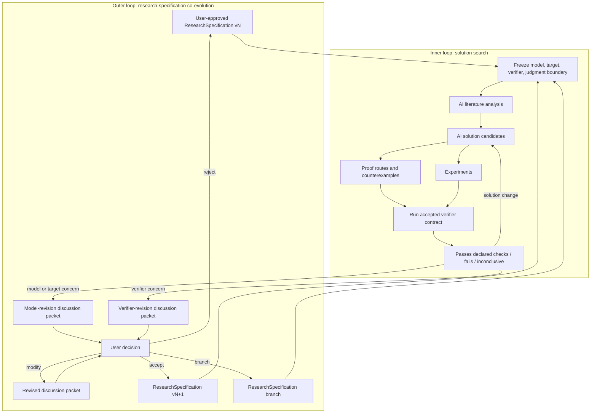
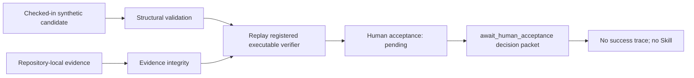
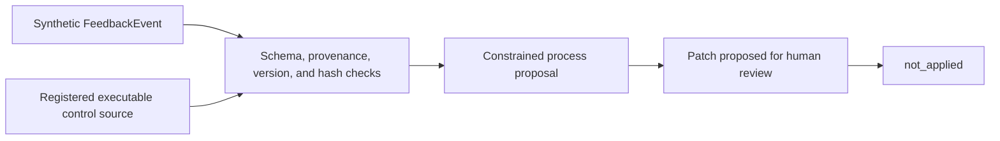
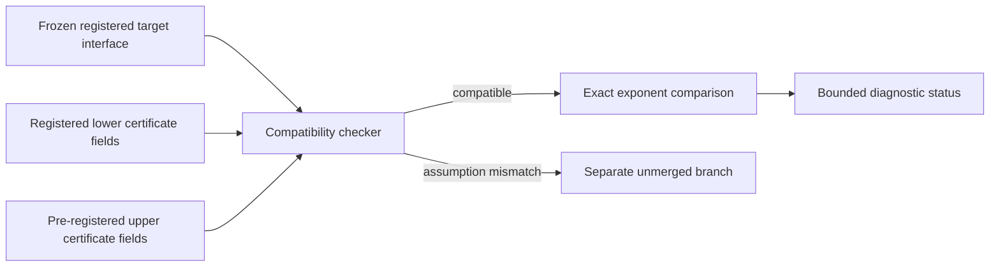
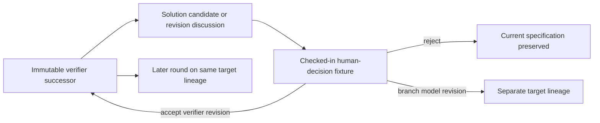

# Architecture

VeriSpiral studies how to jointly design Goal/Metric, Setup, Verifier, and
Algorithm under a shared research budget. Its intended decision is which
experiment or revision to attempt next when a failure may belong to the
algorithm, evaluator, formulation, objective, or implementation. User authority,
immutable specifications, and evidence scope constrain that search.

There are two approximation boundaries: a real need is represented by a setup
and measurable goal; an expensive goal assessment is approximated by a cheaper
verifier. Both mappings require evidence beyond the component being optimized.
The [research agenda](research-agenda.md) defines proposed hypotheses,
comparisons, costs, transfer measures, and stopping rules. No measured benefit
or autonomous research capability is claimed by this architecture.

The public demonstrations remain small deterministic mechanisms. A
[connected workflow](connected-workflow.md) now executes the supported small-DAG
adapter from a recorded specification decision through checks, bounded repair,
and a separately accepted screen revision. The broader architecture below
remains a design contract; prose understanding and general synthesis are absent.

## System boundary

The repository contains:

1. role and protocol policy expressed in Markdown;
2. typed artifact contracts expressed as JSON Schema;
3. deterministic validation, transformation, replay, and audit code; and
4. synthetic fixtures and tracked reference outputs.

It contains no LLM integration, live literature search, real experiment
runtime, algorithm generator, proof engine, persistent user model, automatic
approval, or patch-application service.

## Target architecture: diagnosis before revision

The following roles describe responsibilities; they need not be separate
models or agents, and are not implemented live services.

| Role | Responsibility | Required limit |
| --- | --- | --- |
| Goal and setup designer | Propose measurable objectives, assumptions, task scope, and external anchors | The user selects trade-offs; changed targets create separate lineages |
| Candidate searcher | Produce algorithms or other solutions within a frozen specification | Cannot redefine the accepted goal or evaluator to rescue a candidate |
| Verifier synthesizer | Propose mathematical checking mechanisms, calibration, and promotion rules | Account for build cost, call cost, selected-candidate fidelity, and diagnostic feedback |
| Verifier red-team auditor | Attack the contract and implementation with counterexamples and exploits | Separate audit context and evaluator access; role separation alone is not independent evidence |
| Diagnostician | Maintain competing failure explanations and request distinguishing experiments | Preserve uncertainty, unknown causes, noise, and possible multiple faults |
| Budget controller | Select affordable next checks, promote to higher fidelity, or stop | Charge construction, calls, failed experiments, rechecks, and human work |
| Anchor evaluator | Assess selected and sampled rejected candidates against the declared target | Keep final evaluation feedback outside adaptation; preserve source scope |

The implemented small-DAG adapter exposes a proposed goal and setup, prewritten
candidate methods, check costs, observed results, and an exhaustive finite
reference. General task adapters would additionally need domain-specific
fidelity levels and external anchors. Controllers see permitted observations,
not planted scoring labels or final-test answers. Adapters must state what their
observations can distinguish and which causes remain outside their scope.

```text
accepted Goal/Metric + Setup + Verifier + budget
    -> candidate and observed failure
    -> competing explanations + affordable distinguishing experiments
    -> chosen experiment -> observation -> remaining explanations
    -> algorithm work / higher-fidelity check / revision discussion / unknown or stop
    -> scoped evidence + costs + versioned user decision when required
```

Proposed state includes the four object versions, candidate identity, observed
evidence, unresolved explanations, experiment history, remaining budget,
promotion status, and final-evaluation exposure. A verifier revision requires
affected-result tracking and re-evaluation; a goal or setup change preserves
the original comparison and opens a separate target lineage. Cross-component
proposals may be coordinated, but solution edits and specification revisions
remain separately reviewable transactions.

The general path is a research target. The specification replay below binds
registered decisions and blocks later work under a superseded verifier. The
connected DAG workflow rechecks its retained candidate under an accepted screen
successor; neither path provides a general dependency graph for research results.

## Authority boundary

The user controls the accepted research specification:

```text
scientific model
+ target
+ verifier contract
+ scientific judgment boundary
```

The scientific model includes the observation process, parameter class,
assumptions, information structure, and admissible interventions. The target
includes the estimand or theorem, loss or objective, comparison class, success
criterion, and kill conditions. The verifier contract states what will be
checked and what a result is allowed to support.

AI may search literature, generate solution candidates, develop proof routes,
seek counterexamples, design or run experiments, and analyze failures. These
are intended responsibilities, not capabilities exercised by the public
runner. AI may also draft a model- or verifier-revision discussion packet. It
may not authorize that packet. The public co-evolution runner applies only a
pre-registered human-decision fixture whose references and hashes validate.

Only the user may:

- accept the working model and target;
- approve or revise the verifier contract;
- decide whether evidence is sufficient for scientific interpretation;
- accept, reject, modify, or branch a model/verifier revision proposal; and
- authorize a manuscript-facing claim.

## Two-loop architecture



The inner loop freezes the entire specification. The outer loop changes the
specification only through an explicit user decision. “Co-evolution” refers to
this evidence-and-decision process; it does not mean automatic learning from a
user over time.

Full transition semantics are in [research-specification
co-evolution](research-specification-coevolution.md).

## Three non-interchangeable changes

| Change | Examples | What it cannot do |
| --- | --- | --- |
| Solution change | New algorithm, theorem candidate under the same target, proof route, counterexample, experiment, or explanation | Alter the model, target, verifier, or interpretation boundary |
| Model change | Observation model, parameter class, assumptions, information structure, loss, target, baseline class, or success criterion | Pretend to be progress on the unchanged parent problem |
| Verifier change | Check logic, accepted evidence types, thresholds, certificate interface, fixtures, or result interpretation | Change the model or target, or preserve prior passes without re-evaluation |

A target change is a model/specification revision with an explicit target
delta. A coupled model-and-verifier revision may use one composite packet only
when the two deltas and their effects remain separately reviewable. It cannot
contain a solution delta. The user decides whether the proposal is accepted,
rejected, modified, or branched.

## Core conceptual artifacts

| Artifact | Carries | Authority boundary |
| --- | --- | --- |
| `ResearchSpecification` | Versioned model, target, verifier contract, and judgment boundary | Accepted only by the user |
| `SolutionCandidate` | Algorithm, theorem candidate, proof route, counterexample plan, experiment, or exposition | Cannot mutate the specification |
| `CheckResult` | Verifier version, inputs, output, scope, and known blind spots | Means only what the accepted contract declares |
| `ModelRevisionDiscussionPacket` | One model/target delta, trigger, affected results, costs, risks, and user questions | AI-authored proposal; AI cannot authorize it |
| `VerifierRevisionDiscussionPacket` | One verifier delta, motivating false pass/fail or gap, affected results, and regression plan | AI-authored proposal; AI cannot authorize it |
| Coupled revision packet | Explicit model and verifier deltas plus separate impact analyses | Still a specification revision; never a solution patch |
| `UserDecision` | `accept`, `reject`, `modify`, or `branch`, with rationale | Required before a new specification version exists |

The public repository implements a deterministic subset of these artifacts. It
does not implement the AI activities that would produce them during live
research.

## Executable artifact contracts

| Artifact | What the public runner checks | What it does not establish |
| --- | --- | --- |
| `CandidateIdea` | Required fields for claim, assumptions, risks, evidence locators, checks, and Skill blueprint | Truth, novelty, or a good scientific target |
| Evidence reference | Repository-local path, identity, and hash linkage | Semantic correctness or independence of the evidence |
| `VerificationReceipt` | Semantic-subject hash, registered executable verifier identity, evidence bindings, replay result, scope, and limitations | Human acceptance or general scientific truth |
| `DecisionPacket` | Five stage statuses, receipt binding, limitations, questions, and `await_human_acceptance` | A success trace, Skill, user acceptance, or scientific authority |
| `FeedbackEvent` | One synthetic process-feedback signal with a registered executable control source and target component | A real user history or research-specification revision |
| `EvolutionPatch` | One process-only unapplied patch proposed for human review | Acceptance, application, or online evolution |
| Theory certificate | Registered source locator, declared problem interface, assumptions, and rate exponents | Source-proof correctness or validity of the extraction |
| Assumption branch | Explicit changed assumptions, parent reference, and non-merge status | User acceptance of the changed scientific model |
| `ResearchSpecification` | Registered model, target, verifier, judgment boundary, version, and hash | That the specification is scientifically correct |
| Revision discussion | AI proposal bound to a base and proposed specification | Authorization to change the specification |
| Human-decision fixture | `accept`, `reject`, `modify`, or `branch` bound to the discussion and proposed hash | Live user input or proof of human identity |
| Co-evolution trace | Event links, same-target verifier succession, separate model lineages, and target-credit isolation | Algorithm generation, proof generation, or scientific truth |

## Public demo 1: five-stage candidate review



The five stage fields are structural validation, evidence integrity, semantic
verification, human acceptance, and candidate lifecycle. The default fixture
actually replays the repository-registered verifier and checks that its receipt
binds the complete semantic subject, declared evidence, verifier artifact, and
replay output. Human acceptance remains `pending`; therefore the tracked run
contains only a decision packet and manifest. It emits no success trace and no
Skill.

## Public demo 2: feedback-to-process-patch



This demo concerns a process instruction only. Its input source must remain
bound to executable control evidence rather than a self-declared success. It
does not propose a scientific model change, target change, or verifier change.
It does not record a human decision or edit the target component.

## Public demo 3: bandit certificate compatibility



The CLI command is named `minimax`, but its implementation is a certificate-
compatibility checker. It compares registered strings and rational exponents.
It does not check a proof, validate a source extraction, infer class
containment, generate a new algorithm, or approve a minimax statement.

## Public demo 4: research-specification co-evolution



The runner validates specification hashes, event references, revision class,
and the exact specification selected by the registered decision. An accepted
verifier-only revision supersedes the earlier verifier version but remains on
the same target lineage, so later work continues that target under the accepted
successor. A model revision—and any coupled model-and-verifier revision—creates
a separate lineage and cannot count as solving the original target.

This is deterministic state-machine replay. It does not capture live user input,
verify the actor's real-world identity, generate a solution or proof, or decide
that the specification is scientifically sound.

## Public demo 5: budgeted checks and simultaneous failure indicators

The [diagnosis guide](diagnosis-demo.md) separates the
[controllers](../src/verispiral/diagnosis.py) from a
[finite adapter](../src/verispiral/diagnosis_demo.py). Its ten public cases cover
seven individual failed-check patterns, one passing control, and two simultaneous
patterns. The default controller maps each narrow failure indicator to a distinct
observable check. It chooses the cheapest affordable unobserved check and retains
all observed failures together, without assigning an exclusive cause.

Supported completion requires every registered check; insufficient budget leaves
pending checks and unresolved indicators explicit. The older signature API still
ranks checks by equal-weight expected eliminations per cost, but even a singleton
must undergo the remaining coverage checks. Contradictory supplied signatures
produce model mismatch; indistinguishable complete signatures remain inconclusive.
Neither API supplies calibrated causal probabilities or an optimal allocation claim.

Planted labels are used only after execution for scoring. The
[report](../examples/expected/diagnosis/diagnosis_report.json) and
[tests](../tests/test_diagnosis.py) show these finite behaviors, including the
additional coverage cost. Unknown and mean-preserving failures may remain invisible.
This adapter always has a finite reference and does not change specifications or
generate algorithms; its two simultaneous patterns are not general diagnostic validation.

## Public connected workflow: reviewed DAG specification to rechecked successor

The [workflow guide](connected-workflow.md),
[implementation](../src/verispiral/research_workflow.py), and
[demo summary](../examples/expected/workflow/demo_summary.json) define a separate,
bounded execution path. A text document and typed DAG setup produce a reviewable
adapter proposal. A matching recorded decision freezes it before any candidate
execution. The runner invokes prewritten methods, observes four nonexclusive
failure indicators, charges declared edge work, and repairs a candidate or witness
within the accepted budget and round limit.

A detected weak-screen disagreement remains visible after candidate repair and
requires a recorded screen-revision decision. The successor preserves the goal
and setup, retains the candidate, and reruns all registered checks under the new
specification; old receipts cannot make it ready. Missing checks prevent readiness,
and a checked candidate still awaits human acceptance. The public demo decisions
are synthetic, and the runner cannot authenticate a human identity.

This path supports numbered integer DAGs with 2–12 nodes and all nodes reachable
from source zero. It does not interpret prose, synthesize new algorithms or
verifiers, automate goal/setup revision, or validate real research effectiveness.

## Trust boundaries

The [shortest-path trial](path-workflow-study.md) is a sixth executable path.
It executes prewritten solvers and certificate checks with a separate exhaustive
reference and path scorer. An outcome-triggered witness repair has its own plan
bound to the initial summary; it changes neither the submitted path nor its goal.
This supplies concrete development feedback for the iteration protocol, without
implementing an LLM controller or demonstrating cheaper research.

| Input or result | Default treatment | Required response |
| --- | --- | --- |
| AI literature summary | Source-dependent proposal | Preserve exact sources and let the user judge coverage |
| AI solution candidate | Untrusted proposal | Evaluate under the frozen specification |
| Proof route or counterexample | Candidate reasoning | Audit or execute it; preserve failures and uncertainty |
| Experiment | Scoped evidence | Record design, data, code, result, and limitations |
| Mechanical gate pass | Software status | Do not relabel it as scientific verification |
| Passed executable receipt | Result of one registered verifier replay in its declared scope | Require explicit human acceptance before any success trace or Skill |
| Certificate-compatibility status | Bookkeeping diagnostic | Return theorem and extraction judgments to the user |
| Model/verifier discussion packet | Proposed specification delta | User must accept, reject, modify, or branch |
| User decision | Specification-control event | Preserve scope and rationale; do not call it proof |

## Current boundary

The public runner demonstrates deterministic structure, executable receipt
replay, a pending-human stop, process-patch non-application, verifier succession,
model-lineage branching from registered decision fixtures, and budgeted
nonexclusive failure checks. The connected DAG path additionally consumes a
recorded decision file, runs prewritten candidate methods and repairs, and
creates a screen-revision proposal whose accepted successor requires rechecks.
It does not implement:

- AI literature retrieval or coverage assessment;
- prose understanding or general solution, theorem, proof, counterexample,
  experiment, or algorithm synthesis;
- general model- or verifier-revision synthesis beyond the declared DAG screen switch;
- a live decision-capture interface or human-identity verification;
- automatic authorization of specification changes or process-component
  application;
- persistent user modeling, personalization, or long-term learning; or
- production orchestration, monitoring, or rollback execution.

Those omissions prevent the design document from being read as evidence for a
deployed self-improving research system.
