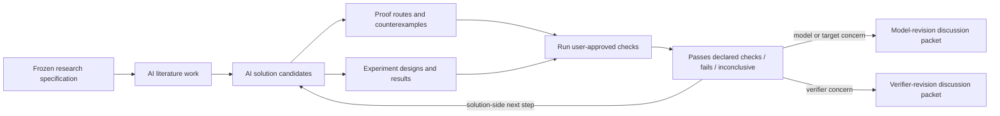
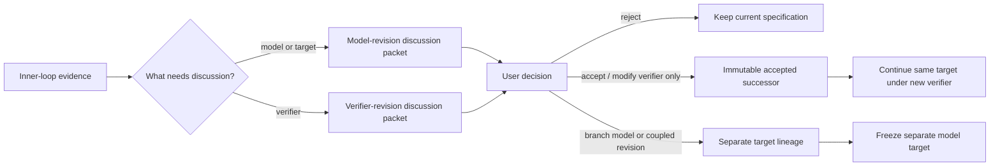

# Research-specification co-evolution

VeriSpiral separates two processes that are often blurred together:

1. **solution search inside a fixed research specification**; and
2. **user-controlled revision of the research specification itself**.

The first is an inner loop. The second is an outer loop. AI may work intensively
inside both loops, but only the user may accept a change to the scientific
model, target, verifier, or interpretation boundary.

The public repository implements a bounded, deterministic replay of this
control structure. It can validate a pre-registered human-decision fixture,
continue the same target under an immutable verifier successor, and isolate a
model change on a separate lineage. It does not capture live user input, prove that the fixture came
from a real person, run an LLM, search the literature, generate an algorithm or
proof, or maintain a longitudinal user model.

## What “model” means here

In this document, **model** means the scientific problem formulation, not an
LLM and not model weights. A versioned `ResearchSpecification` contains:

- the scientific model: observation process, parameter class, assumptions,
  information structure, and admissible interventions;
- the target: estimand, theorem shape, performance criterion, comparison class,
  and success or kill conditions;
- the verifier contract: which checks are admissible, their inputs, their
  failure modes, and what a passing result is allowed to support; and
- the scientific judgment boundary: which decisions always return to the user.

The user owns the accepted version of every field. AI output can propose a
delta, but cannot silently edit the authoritative specification.

## Responsibility boundary

| Responsibility | AI may do | User retains authority over |
| --- | --- | --- |
| Modeling | Surface hidden assumptions, compare formulations, identify incompatibilities, and draft alternatives | Adopted observation model, parameter class, assumptions, and information structure |
| Target | Suggest theorem shapes, objectives, baselines, measurable criteria, and kill conditions | Which target is scientifically meaningful and worth pursuing |
| Verifier | Propose checks, adversarial cases, diagnostics, and revisions to a check | Which verifier contract is accepted and what its output is allowed to mean |
| Literature | Search, extract, compare, and map collisions with source provenance | Whether coverage is sufficient for the scientific decision |
| Solution search | Generate candidate algorithms, proof routes, counterexamples, experiments, and failure analyses | Which candidates advance, branch, stop, or become claims |
| Scientific interpretation | Summarize evidence and expose uncertainty | Novelty, theorem correctness, paper-worthiness, authorship, and manuscript-facing claims |

The public code does not implement most AI-side activities in this table. They
describe the intended division of labor, not current executable coverage.

## Inner loop: solution search under a frozen specification

Every inner-loop run starts from an immutable specification identifier:

```text
spec_id
model_version
target_version
verifier_version
judgment_boundary_version
```



The inner loop may change a candidate solution. It may not change the model,
target, verifier, or scientific judgment boundary. A machine result such as
“passes declared checks” is scoped to the named verifier version. It is not a
synonym for “scientifically verified.”

## Outer loop: user-controlled specification co-evolution

When the inner loop exposes a problem with the formulation or evaluation
contract, AI may prepare a discussion packet. AI cannot authorize the revision.



“Co-evolution” means that AI-generated evidence and a user decision can lead to
a new, explicitly versioned research specification. In the public replay, that
decision is checked-in input whose references and hashes are validated before a
successor or separate branch is created. This does not mean that the agent learns a user's preferences
over time, establishes the decision-maker's identity, or updates the
specification on its own.

## Discussion-packet contract

A model- or verifier-revision discussion packet should include:

- the current specification and exact triggering evidence;
- one revision type and one explicit delta, or a declared
  `model_and_verifier_revision` with separate model and verifier deltas;
- why the issue cannot be resolved as a solution change;
- affected claims, candidates, comparisons, and prior check results;
- new assumptions, costs, risks, and unresolved questions;
- required literature, proof, counterexample, or experiment work;
- regression checks and a rollback or branch reference; and
- the required user action: `accept`, `reject`, `modify`, or `branch`.

The packet is a decision aid. The public co-evolution runner can record and bind
a pre-registered `accept`, `reject`, `modify`, or `branch` event to the exact
discussion and proposed-specification hash. That record demonstrates fixture
validation and state transition, not live approval or human identity.

An `accept`, `modify`, or `branch` event must keep the discussion packet's
revision class. For example, a `model_revision` discussion cannot be turned
into a same-lineage `verifier_revision` by changing only the decision payload;
that requires a new proposal and discussion. The replay also recomputes each
event's source-payload hash from the registered scenario, so a self-consistent
rewriting of the event chain is not sufficient to change its meaning.

## Three change classes

Every proposed delta belongs to exactly one class.

| Change class | May change | Must remain frozen | Consequence |
| --- | --- | --- | --- |
| **Solution change** | Candidate algorithm, supporting lemma or proof claim that leaves the accepted theorem target unchanged, proof route, counterexample search, experiment, or exposition | Model, target, verifier, and judgment boundary | Continue the inner loop; prior comparisons remain scoped to the same specification |
| **Model change** | Scientific formulation and/or target, including assumptions, parameter class, observation model, loss, comparison class, or success criterion | Original target lineage | Create a separate target lineage; do not report it as progress on the original target |
| **Verifier change** | Check logic, accepted evidence type, thresholds, test cases, certificate interface, or interpretation rule | Model and target | Create an immutable successor on the same target lineage and re-run affected checks; an earlier pass does not transfer automatically |

A target change is therefore recorded as a model/specification revision, with
its target delta shown explicitly. A solution change may never be mixed with a
model or verifier change. When model and verifier must change together, a
composite packet may use `model_and_verifier_revision`, but it must expose both
deltas, both impact analyses, and the fact that the model delta forces a
separate target lineage. The user still decides whether to reject, modify, or
branch the combined proposal; it cannot be installed as a same-target verifier
successor.

## Routing failures without laundering them

| Observation | Correct route | Incorrect shortcut |
| --- | --- | --- |
| A candidate fails an accepted check | New solution candidate or stop | Weaken the verifier inside the same solution patch |
| The target is impossible or no longer scientifically useful | Model-revision discussion packet | Quietly replace the target and call the old problem solved |
| An assumption must be strengthened | Model branch | Edit the parent assumption ledger in place |
| The verifier rejects known-valid fixtures | Verifier-revision discussion packet | Special-case the candidate without changing verifier version |
| The verifier passes a known counterexample | Verifier-revision discussion packet plus affected-result audit | Keep the pass and add a prose caveat |
| A proof or experiment is inconclusive | Continue solution search or return to the user | Convert uncertainty into a positive reward label |

## User decision semantics

- **Accept:** for a verifier-only revision, select the exact AI-proposed
  specification as an immutable successor on the same target lineage.
- **Reject:** preserve the current version and record why the proposal was not
  adopted.
- **Modify:** select a distinct, registered human-modified specification while
  preserving the proposal's revision class. A verifier-only modification is an
  immutable successor on the same target lineage; a model or coupled
  modification remains a separate target lineage. This is not equivalent to
  accepting the AI proposal, and switching revision class requires a new
  discussion packet.
- **Branch:** for a model or coupled model-and-verifier revision, select the
  proposal as a distinct exploratory target lineage while preserving the
  original target.

None of these actions establishes scientific truth. They determine which
specification the next research cycle is allowed to use.

The public runner encodes every non-rejected specification change as a new
immutable record. A verifier successor supersedes the previous verifier record
but keeps its `target_lineage_id`; later work continues the same target. A model
change receives a new lineage identifier and cannot contribute progress to the
original target. No record is mutated in place.

## How the public demos map to this design

| Public demo | What it actually exercises | What it does not exercise |
| --- | --- | --- |
| Five-stage candidate review | Structural and evidence-integrity checks, actual replay of a registered executable verifier, receipt binding, and a pending-human stop | Human acceptance, success-trace emission, Skill emission, or scientific validation |
| Feedback-to-patch | One synthetic process-feedback event plus a registered executable control source mapped to an unapplied patch proposed for human review | Research-model revision, verifier revision, acceptance, application, or longitudinal adaptation |
| Bandit certificate replay | Exact comparison of registered interface strings, assumptions, and rate exponents; explicit assumption branching | Proof checking, source-extraction validation, algorithm generation, or acceptance of a minimax claim |
| Research-specification replay | Validation of registered specifications, an AI discussion packet, a pre-registered human decision, same-target verifier succession, and separate model lineage creation | Live user capture, proof of human identity, autonomous model/verifier revision, algorithm generation, proof generation, or scientific truth |

The default candidate fixture has no human acceptance record and emits no
success trace or Skill. Its passed executable receipt remains limited to the
registered verifier's scope. The `minimax` command is likewise a certificate-
compatibility replay, not a theorem verifier.

## Non-negotiable invariants

1. The user owns the accepted model, target, verifier, and scientific judgment
   boundary.
2. The inner loop freezes the complete research specification.
3. AI may propose model or verifier revisions only through discussion packets.
4. Only the user may accept, reject, modify, or branch those proposals.
5. A solution delta never shares a patch with model or verifier deltas; a
   coupled model-and-verifier packet keeps its two deltas explicit.
6. A changed model or target creates a separate lineage and never counts as
   solving the original target.
7. A changed verifier may succeed the old verifier on the same target lineage,
   but affected results must be re-evaluated under the successor.
8. A passing mechanical gate never becomes theorem correctness, novelty, or
   paper-worthiness by relabeling.
9. Replaying a registered user decision is not live interaction, identity
   verification, autonomous scientific judgment, algorithm generation, proof
   generation, personalization, or long-term learning.
