# Change-control workflow

VeriSpiral uses “evolution” to mean an explicit, versioned proposal to change
external agent or research state. The term does not mean model-weight training,
automatic personalization, continuous learning, or silent policy rewriting.

There are two different change-control paths:

1. a **process-feedback path** for Prompt, Skill, Schema, role, or collaboration
   instructions; and
2. a **research-specification path** for the scientific model, target, verifier,
   and judgment boundary.

The current repository implements deterministic, checked-in examples of both
paths. The research-specification replay validates a registered decision
fixture, continues the same target through an accepted verifier successor, and
isolates a model revision on a separate lineage. It does not capture live user
input or establish the decision-maker's identity. The full contract is described in
[research-specification co-evolution](research-specification-coevolution.md).

## Roles and authority

- **User:** owns the accepted scientific model, target, verifier, and judgment
  boundary; accepts, rejects, modifies, or branches proposed revisions.
- **AI:** may conduct literature work, propose solutions, develop proof routes,
  seek counterexamples, design experiments, and draft discussion packets.
- **Project owner:** controls repository releases and operational policy.

The same person may be both user and project owner, but AI never inherits the
user's scientific authority.

## Process-feedback path

```mermaid
stateDiagram-v2
    [*] --> FeedbackEvent
    FeedbackEvent --> Gate: validate schema, scope, provenance, version, and hashes
    Gate --> Rejected: invalid or unsupported
    Gate --> Proposal: checks pass
    Proposal --> Patch: render one process-only delta
    Patch --> HumanBoundary: proposed_for_human_review
    HumanBoundary --> [*]: stop; not_applied
```

The public runner stops at `not_applied`. It does not contain a user-review
interface, record acceptance, edit a component, activate a version, or execute
rollback.

## Public transition contract

| Stage | Public artifact or check | Meaning | Does not mean |
| --- | --- | --- | --- |
| Feedback | `FeedbackEvent` with `signal_type: user_feedback_signal` | One synthetic, explicit process request | A real interaction history or a scientific judgment |
| Provenance | Registered executable control source, manifest, decision packet, component version, and hashes | The input graph matches the registered public fixture | The underlying research content is correct |
| Scope | One allowlisted `process_instruction_only` delta | The proposal is bounded to one component change | Permission to change a model, target, or verifier |
| Proposal | `EvolutionProposal` | Deterministic rendering of the checked request | User acceptance |
| Patch | `decision_status: proposed_for_human_review` | A reviewable, unapplied process delta | A completed human review |
| Stop state | `apply_status: not_applied`; acceptance checks `not_run` | Target bytes remain unchanged | Activation or rollback execution |

## Executable receipt and human boundary

The candidate demo replays a repository-registered executable verifier and
checks its receipt against the complete semantic subject. That receipt remains
scoped to the registered control contract. Human acceptance is a separate stage
and remains pending in the public fixture, so the run emits no success trace or
Skill.

## Research-specification path

A problem encountered during solution search must first be classified:

| Issue | Correct output | User action required |
| --- | --- | --- |
| Candidate algorithm, proof route, counterexample, or experiment needs work | Solution change inside the frozen inner loop | Decide whether to continue, redirect, or stop |
| Scientific model or target needs revision | Model-revision discussion packet | `accept`, `reject`, `modify`, or `branch` |
| Accepted check is incomplete, unsound, or mis-scoped | Verifier-revision discussion packet | `accept`, `reject`, `modify`, or `branch` |

A solution change must never share a patch with a model or verifier change. A
model or target revision creates a separate target lineage. A verifier-only
revision may become an immutable successor on the same lineage, but affected
results must be re-evaluated. A declared
`model_and_verifier_revision` may keep both deltas in one discussion packet only
when they remain separately reviewable. AI may draft a packet, but it cannot
make the user decision or authorize the change.

## Discussion packets are not patches

A research-specification discussion packet names:

- the frozen parent specification;
- the triggering literature, proof, counterexample, or experiment evidence;
- one model or verifier delta, or separately visible model and verifier deltas
  for a declared coupled revision;
- affected candidates, comparisons, and prior check results;
- costs, assumptions, risks, and unresolved questions; and
- the decision requested from the user.

It is a structured conversation object. The feedback-to-patch demo does not
implement this packet and must not be presented as if it revises a research
model or verifier. The separate research-specification replay does validate a
checked-in discussion packet and its bound decision fixture.

## What runs today

The public repository contains four bounded deterministic replays:

1. **Five-stage candidate review:** passes structural and evidence-integrity
   checks, replays a registered executable verifier, then stops at
   `await_human_acceptance` with no success trace or Skill.
2. **Feedback-to-process-patch:** maps one synthetic event to one unapplied
   process patch proposed for human review.
3. **Bandit certificate compatibility:** compares a pre-registered sequence of
   certificate interfaces, assumptions, and rate exponents while preserving an
   assumption branch.
4. **Research-specification co-evolution:** validates registered specifications,
   a revision discussion, and a pre-registered human-decision event; continues
   a target under an immutable accepted verifier successor; and isolates a model
   change on a separate lineage without target credit.

None of them runs the complete inner or outer research loop. The bandit
candidates are already in the scenario; the runner does not generate an
algorithm. The certificate checker does not validate proofs or sources. The
feedback path does not record a human decision or apply a patch. The
research-specification path replays a registered decision but does not capture
one live, verify human identity, or establish scientific correctness.

## What is not implemented

- live user interaction capture;
- AI literature search, candidate generation, proof development,
  counterexample search, or experimentation;
- live AI generation of model- and verifier-revision discussion packets;
- live user-decision capture or human-identity verification;
- automatic scientific authorization, process-patch application, monitoring,
  or rollback; and
- persistent personalization, longitudinal user modeling, or long-term
  learning.

## Invariants

1. The user owns the model, target, verifier, and scientific judgment boundary.
2. Feedback and AI self-reflection are not scientific evidence by themselves.
3. A mechanical pass is reported only as passing declared checks.
4. Solution changes remain separate from model and verifier changes; a coupled
   model-and-verifier packet exposes both deltas.
5. AI may propose specification revisions but never authorize them.
6. Changed assumptions or targets create a separate lineage; a verifier-only
   successor may continue the same target after affected results are rechecked.
7. The public demos remain deterministic replays, not evidence of autonomous
   or longitudinal evolution.
